Hello World, in this blog, I will be talking about how I deployed my personal portfolio website. At first, I wanted to use third party services to deploy this, but since I've come to think that I've never  tried creating a server from scratch, deploy any application to that server. Might as well I'll try it this time. Before doing anything else, I've gathered all possible requirements that I need.
### Requirements
- **App Running**
- **VPS**
- **DNS**
- **Hardening ssh**
-  **Firewall**
- **Load balancer**
- **Automated deployment**
- **Monitoring** 

---

## Creating Astro Project

The first thing I did is to for this whole project is to create the app/website. I created mine with the help of Astro. Astro is a web framework tool for building content-rich websites. It features something like  island architecture, where you can specify rendering methods, either for server-rendered components or client-rendered components. Here is a sample scenario:

#### Client Island
Astro, by default, default, will render components as static HTML and remove unnecessary client-side JavaScript, stripping out all client-side automatically. Now you have multiple components.

```astro
<Counter />
<ThemeToggle />
<Weather />
<Video />
<Animation/>
```
Now you wanted to optimize it and choose when each component becomes interactive, you will just the configure it by passing a prop.

```astro
<Counter client:load/> 
<ThemeToggle client:idle/>
<Weather client:visible/>
<Video client:media = "(min-width: 1024px)"/>
<Animation client:only/> 
```

- `client:load` runs immediately after the page loads
- `client:idle` waits until browser is idle before loading JavaScript
- `client:visible` waits until the component 
- `client:media` render  on specific media query matches. Like device size (Phone (min-width: 640px),Tablet(min-width:720px), etc)
- `client:only` render on client side only

#### Server Island

You can also set a component to render separately on the server. Imagine you have a dashboard:
```astro
<Header />

<Sidebar />

<Stats server:defer />

<Footer />
```
The Stats component now renders on the server, while everything else is on client.

#### Other features
The reason why I chose this framework is that I can create the structure and components of the website with just plain HTML/CSS and JavaScript. Not that I'm strictly bounded by that rule but I can also import different UI frameworks and use them as my components. 

Second, is that I can create my content easily with Markdown files and render pages with the styles and layouts that I have already configured. 

Example source code:\
`blogs.astro`
```astro
 ---
import BaseLayout from "../../layouts/BaseLayout.astro";
import { getCollection, render } from "astro:content";

export async function getStaticPaths() {
    const posts = await getCollection("blogs");

    return posts.map((post) => ({
        params: { id: post.id },
        props: { post },
    }));
}

const { post } = Astro.props;

const { Content } = await render(post);
---

<BaseLayout webtitle={post.data.title}>

    <article class="blog-content">

        <h1>{post.data.title}</h1>

        <p>
            Author: {post.data.author}
        </p>

        <p>
            Date: {post.data.date}
        </p>

        <Content />

    </article>

</BaseLayout>

```

`first-blog.md`
```md
---
title: "My First Blog"
author: "JC"
date: "July 10, 2026"
tags:
  - Astro
  - Web Development
---

# Hello Astro

This blog is written in **Markdown**.

Astro converts this file into HTML while keeping my custom layout and styles.

## Features

- Markdown content
- Custom CSS styling
- Static page generation
- Component-based layouts
```

These are just few of the things that Astro can do a lot of thing. Check it out here at [Astro official webpage](https://astro.build).

---
## Virtual Private Server

 Before VPS providers became common, developers could host applications directly from their own computers. Instead of renting a server from a cloud provider, your personal computer would act as the server. The computer would run the application, connect to the internet, and accept requests from users.  However, this approach has limitations. Your computer must stay powered on and connected to the internet at all times. You are also responsible for hardware failures, network configuration, security, and maintaining the server environment. Because of these limitations, VPS providers became popular by allowing developers to rent a virtual server that is always online, hosted in a professional data center, and accessible from anywhere.

Now the next step is to find a VPS provider. Before everything else, what is a VPS?

A `VPS (Virtual Private Server)`is, to simplify, your own virtual computer in the cloud. It is a virtual machine hosted on a physical server managed by a cloud provider. This computer can then be configured to run and serve your applications over the internet, such as websites, APIs, databases, or other services. There are couple VPS provider such as DigitalOcean, Azure, AWS, Linode , and more. The provider I chose is `Oracle` since they are giving a generous stuffs.

#### Making Oracle Free Tier
The first step is to create an Oracle free tier account. Visit [Oracle Free Tier Account](https://www.oracle.com/ca-en/cloud/free/) and create an account.

#### High-level Setup Diagram
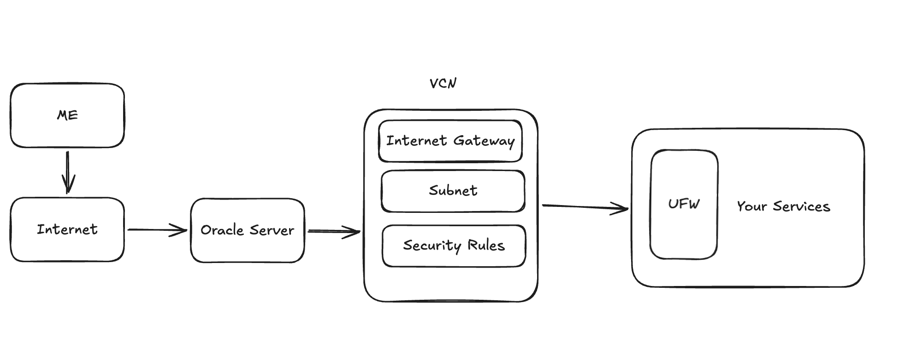 

#### Making VCN
A `VCN(Virtual Cloud Network)`  is a private network inside the cloud. It is similar as having a home network but exist on the cloud. Lets create this in Oracle.

- Click the hamburger button `☰`, go to networking and `virtual cloud networks`. 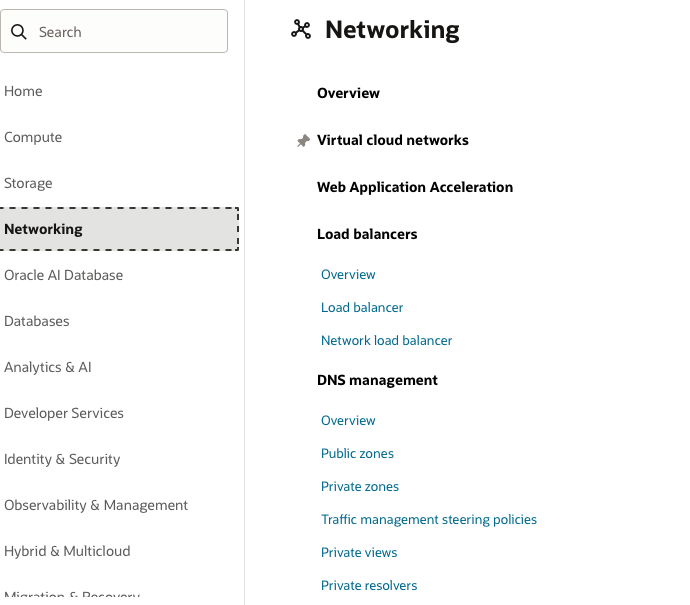
-  Lets create a VCN.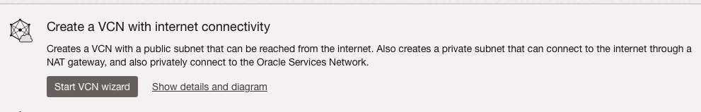
- Lets set up the VCN. 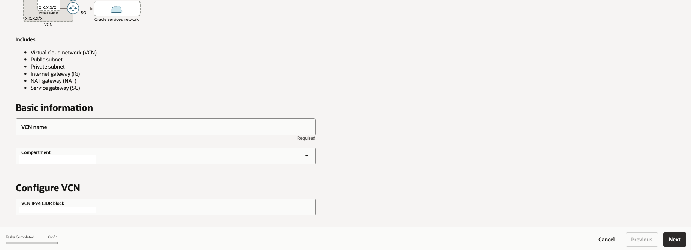
- Click a create to `create` this VCN

#### Creating Instance for the VPS

- Click the hamburger button `☰`, go to networking and `instances`. 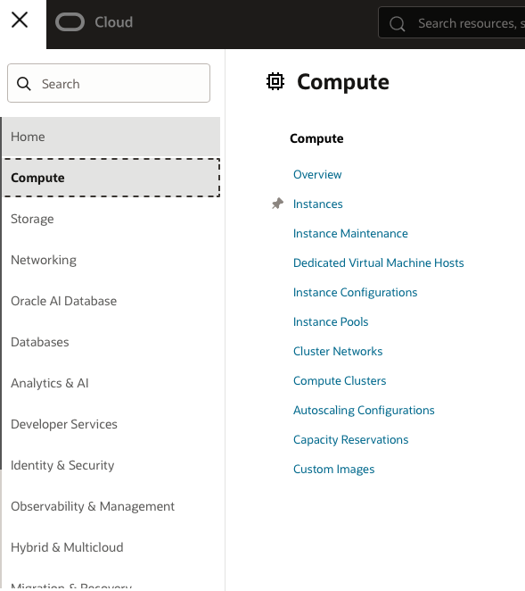
- Create Instance `+` 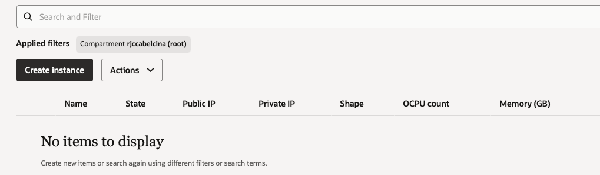
-  Lets select an image. (*Note that I will use a less stronger instance this time since the ampere based processor is not available sometimes* )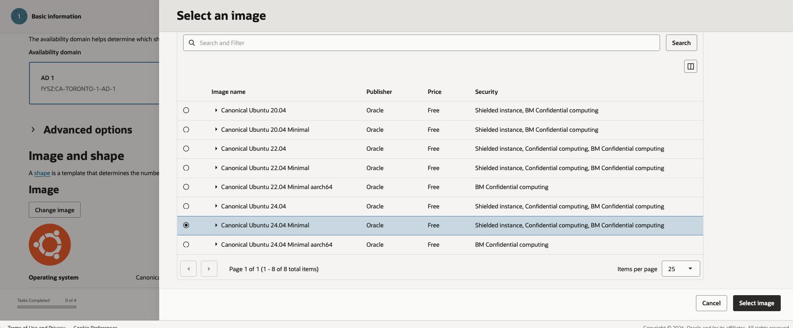
- Select a shape 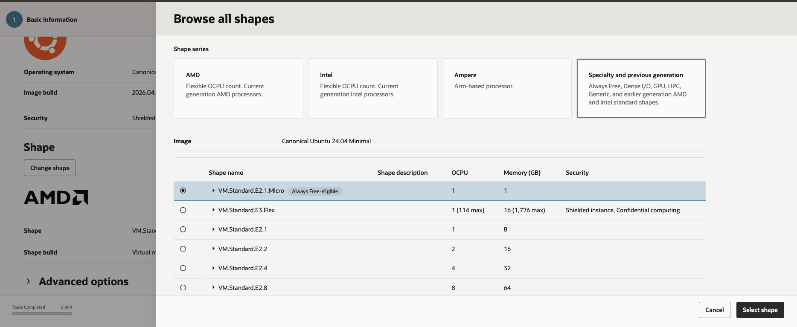
- Leave the security settings default (*i changed this something later*)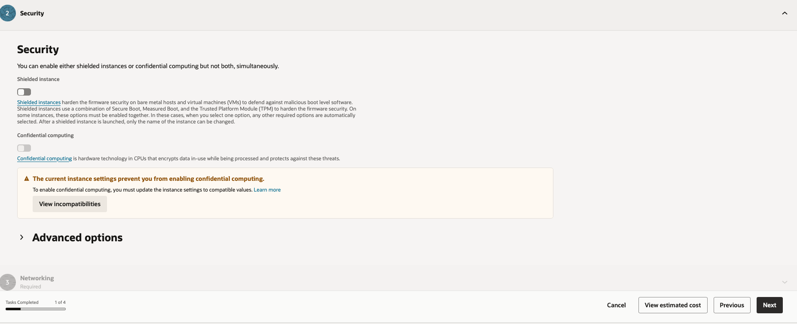
- Set the VCN to the created VCN earlier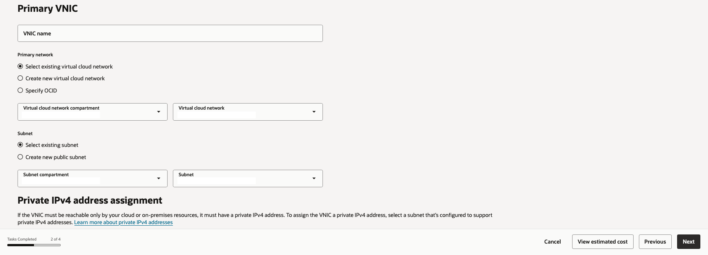
- **IMPORTANT!** Download the ssh key and public key. Make sure to save it somewhere now because you cannot download it later. 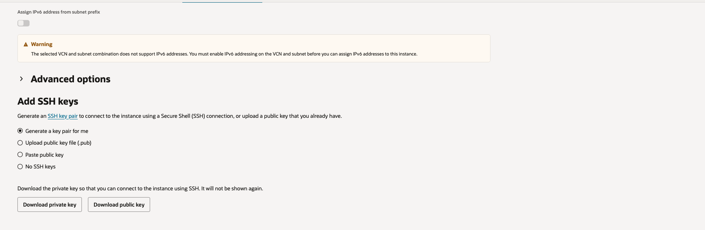
- Set up boot volume. Free tier can only have upto 200gb across all instances. we can also set vpu. This let you change  the disk instantly. But for me since I'm not doing heavy proccesses, I'm just going for the balanced 10. read this document from oracle to learn about it more: https://docs.oracle.com/en-us/iaas/Content/Block/Concepts/blockvolumeperformance.html 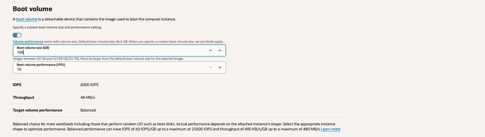
- Create the instance. 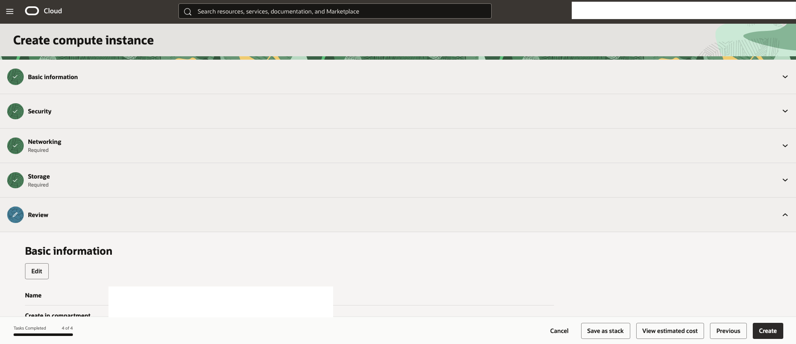
---

## Setting up VPS

#### SSH to the VPS
Now lets first ssh to our VPS. (*I will make a blog about how ssh commands and how it works some time. For now I will just use this as a reference: https://www.digitalocean.com/community/tutorials/ssh-essentials-working-with-ssh-servers-clients-and-keys* )

- Let's go inside the vps we created using ssh. We need the keys that we downloaded earlier. We also need the public ip address that our instance in oracle is using.
- Command to go inside vps:

```bash
ssh -i <drag-key-file-here> ubuntu@ip_address
```
#### Update system packages
Lets update our ubuntu, and update its pre installed applications and services. This also fixes security vulnerabilities and prevents weird install bugs later
- Command to update:
```bash
  sudo apt update && sudo apt upgrade -y
```
#### Install essential tools
Now I'm going to install all the essential tools that we may be need in the future.
- List of the tools:

| Tool     | Purpose                       |
| -------- | ----------------------------- |
| git      | pulls project or debug builds |
| curl     | test APIs / downloads         |
| wget     | fetch files                   |
| unzip    | handle archives               |
| vim/nano | edit server config files      |
| htop     | monitor CPU/RAM usage         |
| rsync    | efficient file deployment     |

- Command/s to install tools:
``` bash
sudo apt install git curl wget unzip vim nano htop rsync -y
```
#### Adding Swap (Virtual Memory)
I need to to have a virtual for my instance just in case because I only have the 1gb one. 
So what is virtual memory? 
**Virtual memory** is a memory management technique used by operating systems to give the appearance of a large continaous block of memory to application even if the physical memory is limited 
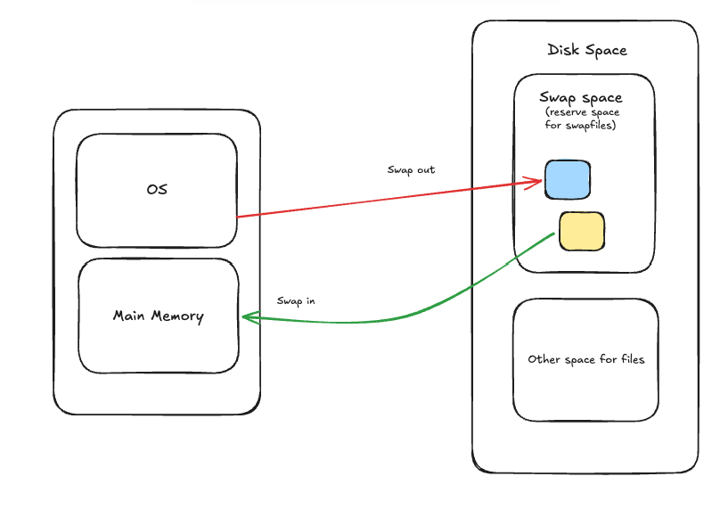
- Lets setup the swap using this command:
```bash
sudo fallocate -l 2G /swapfile #allocates 2GB worth of swap
sudo chmod 600 /swapfile #modifies permission
sudo mkswap /swapfile #- prepares the file so Linux recognizes it as swap memory
sudo swapon /swapfile #activate swap
```
-  lets activate the swap:
```bash
echo 'swapfile none swap sw 0 0' | sudo tee -a etc/fstab
```
#### Firewall
Firewall is a security layer that control network traffic specifically for our virtualized server environment. It ensures our isolated slice of the server is protected from external internet traffic. 

During this project, I got so many problems with the connections and main cause of it was the firewall. I later then found out that oracle explicitly warns against UFW (Uncomplicated Firewall). This is a program to easily configure netfilter firewall rules on Linux. 
`Do not use Uncomplicated Firewall (UFW) to edit firewall rules on an Ubuntu image.`
https://docs.oracle.com/en-us/iaas/Content/Compute/References/bestpracticescompute.html Oracles default security setup will still completely block the website until i fix those iptable rule manually. 

The difference between UFW and iptables is that UFW is just an interface that writes backend rules to Linux's core firewall which is the iptables.

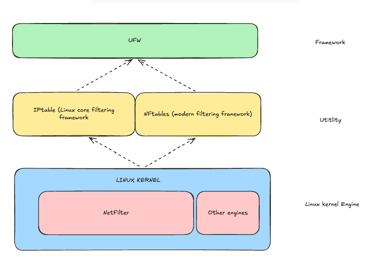
Lets setup the firewall now:

- Lets turn off any UFW just to be sure
```bash
sudo ufw reset # reset configuration
sudo ufw disable #disable on boot
```
- Now lets see all rules in order
```bash
sudo iptables -L INPUT -n --line-numbers
```
- Now lets allow some port with iptables, lets make and insert the rule, and make sure to run it before eveything else.

```bash
sudo iptables -I INPUT 1 -p tcp --dport 80 -j ACCEPT
```

- Do the same for other ports
```bash
sudo iptables -I INPUT 1 -p tcp --dport <port-number> -j ACCEPT
```
- Let's save the current rules
```bash
sudo netfilter-persistent save
```
- (optionally, install a service that saves and restore firewall automatically on reboot)
```bash
sudo apt install iptables-persistent -y
```
#### Basic Protection
Lets add a basic protection package. fail2ban detects repeated failed logins and bans IPs automatically using ssh

```bash
sudo apt install fail2ban -y
```


#### More SSH hardening
Now I wanted to have more control over my vps. I restricted every ip address except my home ip addresss. I'm still trying to harden my ssh access as I can until this present.

---

## Setting up Web Server (NGINX)

We need a program that processes incomming network requests from the public internet using http / https protocols and sends back corresponding website data. That why we are installing nginx. Before installing this, lets know first what nginx is. 

NGINX is a high-performance open-source HTTP web server, reverse proxy, content cache, and load balancer. In analogy, It serves like a traffic controller inside your vps. When a user access your vps, it serves what the user wants and help to manage network traffic easily. *I wil make a blog about nginx as well in the future :)*

#### Setup NGINX
Now lets setup nginx.

- Inside our vps, lets run the command to install nginx
```bash
sudo apt install nginx -y
```
- Lets make nginx to run on boot:
```bash
sudo systemctl enable nginx
```
- Lets start nginx
```bash
sudo systemctl start nginx
```

#### Creating project directory

- Lets create the project directory. This is where we put our finished build file or project.
```bash
sudo mkdir -p /var/www/project
```
- Grant current user access to it with:
```bash
sudo chown -R $USER:$USER /var/www/project
```

#### Changing subnet rules in oracle
We need to change some subnet rules in oracle so the internet can access the port we want to produce.

Here's how:
- Go to the instance 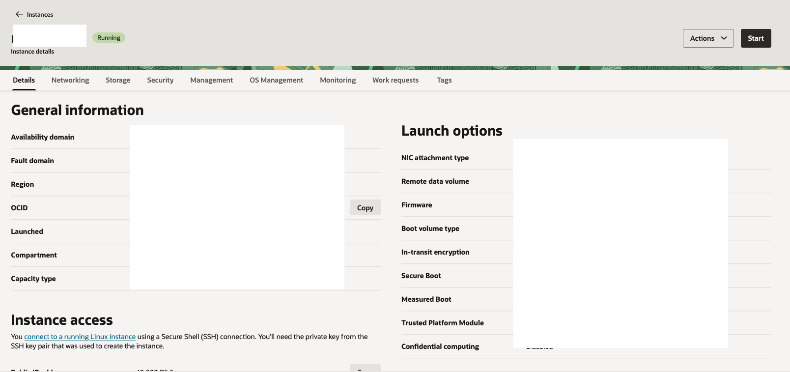
- Scroll down to VNIC and select the VCN thats being used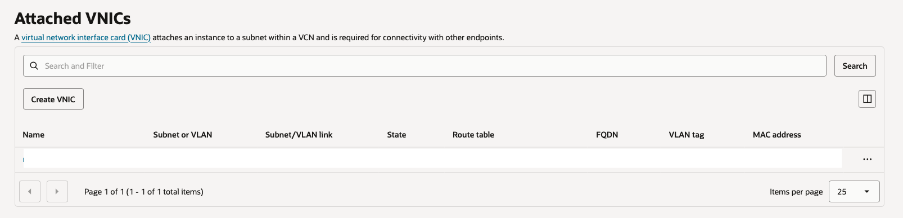
- Go to security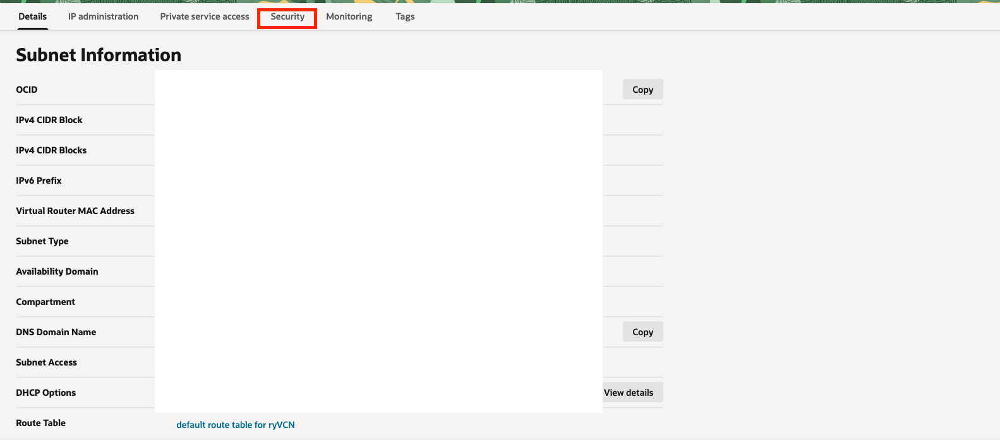
- Add Ingress Rule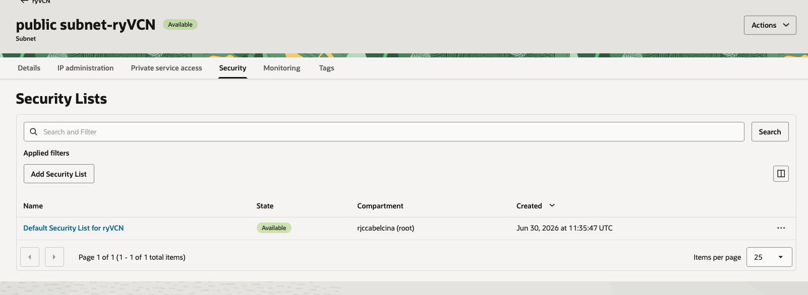
- Add rules for port 443 and 80 (HTTP and HTTPS) 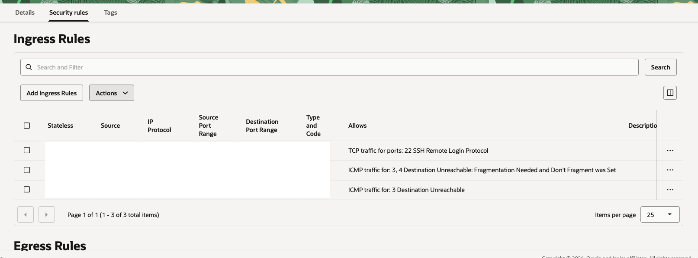
- Set the range of port to 0.0.0.0/0 (*everyone since this is a portfolio website, if we created some management stuff or api thats private then we assign this to the ip we wanted to provide service for*)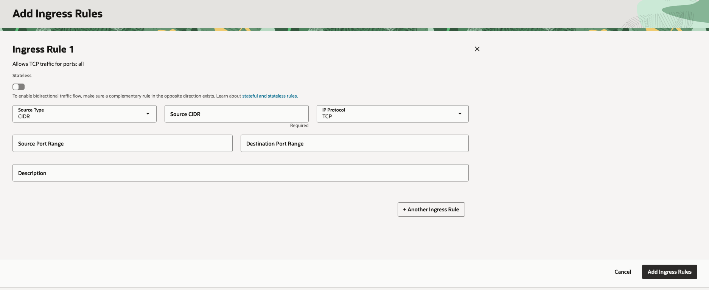

####  Create test page and test connection

Inside vps:
```bash
echo "<h1>Server Works</h1>" > /var/www/project/index.html
```

and visit `http://your_publicipv4` or curl it inside your vps.


#### Configure Nginx

Create a site config for nginx. Edit the configure with:

```bash
sudo nano /etc/nginx/sites-available/project
```

Then paste the configuration:
```JSON
server {    
	listen 80 default_server;
	listen [::]:80 default_server;    
	server_name _;    
	root /var/www/portfolio;    
	index index.html;    
	location / 
		{        
		try_files $uri $uri/ =404;    
		}
	}
```

Then enable this with:
``` bash
sudo ln -s /etc/nginx/sites-available/portfolio /etc/nginx/sites-enabled/
```

Change default_server port of nginx with:
```bash
sudo nano /etc/nginx/sites-available/default
```

and remove default_server port 80 like as shown:
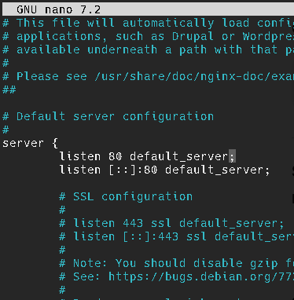

reload nginx:
``` bash
sudo nginx -tsudo systemctl reload nginx
```
---

## Deploying application (manually)

Now I finished setting up vps and web server. I will try to deploy the application manually then forward the build to my vps. I dont want to build my project inside my vps since I have low RAM gb. Swap helps but still slow. So automatic build happens on local or github then forward build files to vps. But now Im going to try to deploy in my local and forward it to my vps

- Deploying my astro project with
```bash
npm run build
```

- Upload build with rsync (forward to the directory)
```bash
rsync -avz -e "ssh -i '<keyhere>' dist/ ubuntu@SERVER_IP:/var/www/portfolio/
```

- Then test it by visiting `http://my_public_ip`

---

## Setting up DNS

DNS stands for Domain Name System. It acts like phonebook where instead of entering the public ip address, it translates into human-readable names like for example `google.com`, `facebook.com`, etc.

Now there are different dns provider and the setup differs from each other. I used [spaceship.com](https://www.spaceship.com) as my dns provider since their dns is kinda cheap and they provide some great free services too. 

Steps on how i setup my dns:
- Bought a dns
- Configure DNS Records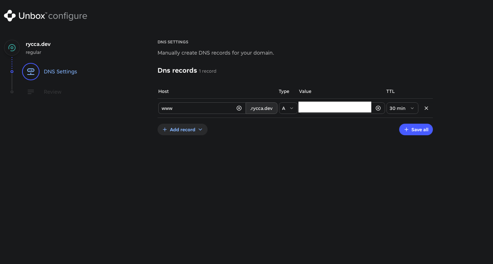
- Wait to progpagate
- Test by visiting the actual dns

---

## HTTPS

**HTTP** transmits data as plain text, making it vulnerable to interception. **HTTPS** (HTTP Secure) adds a TLS/SSL encryption layer, scrambling the data so only the intended recipient can read it. 

Lets make our website https:
- Install certbot:
```bash
sudo apt install certbot python3-certbot-nginx -ysudo certbot --nginx
```
- Run certbot:
```bash
sudo certbot --nginx
```
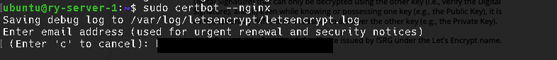
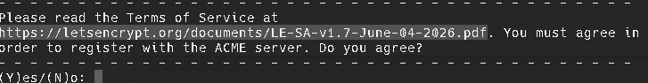

check certbot documentation here: https://certbot.eff.org

---
## Automated Deployment Setup

To automate my deployment, I used github actions to do it for me. I used this workflow to automate my deployment
```yml
name: Deploy VPS

on:
  push:
    branches:
      - main

  workflow_dispatch:


jobs:

  deploy:

    runs-on: ubuntu-latest

    steps:

      - uses: actions/checkout@v6

      - uses: actions/setup-node@v6
        with:
          node-version: 24

      - run: npm ci

      - run: npm run build

      - name: Upload dist
        uses: appleboy/scp-action@v0.1.7
        with:
          host: ${{ secrets.VPS_HOST }}
          username: ${{ secrets.VPS_USER }}
          key: ${{ secrets.VPS_SSH_KEY }}
          source: "dist/*"
          target: "/var/www/rycca.dev"
```


I also created different user inside my VPS intended only for deployments. Then I created different ssh keys tied to that user and used it in my workflow.

## Setting up monitoring and logging

Since this is not that big heavy project, I used built in logs with tmux to easily view different areas of the the logs. 

Heres my tmux setup:

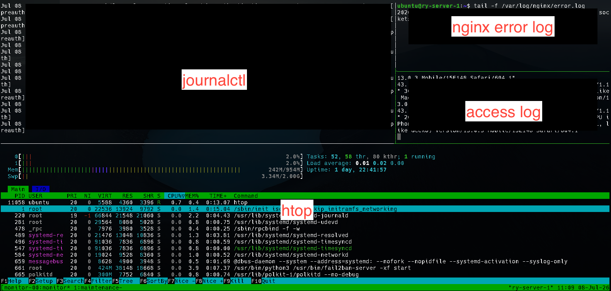
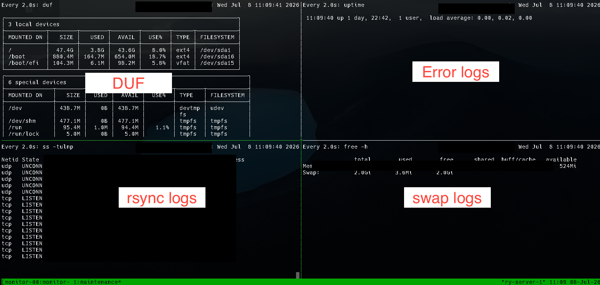